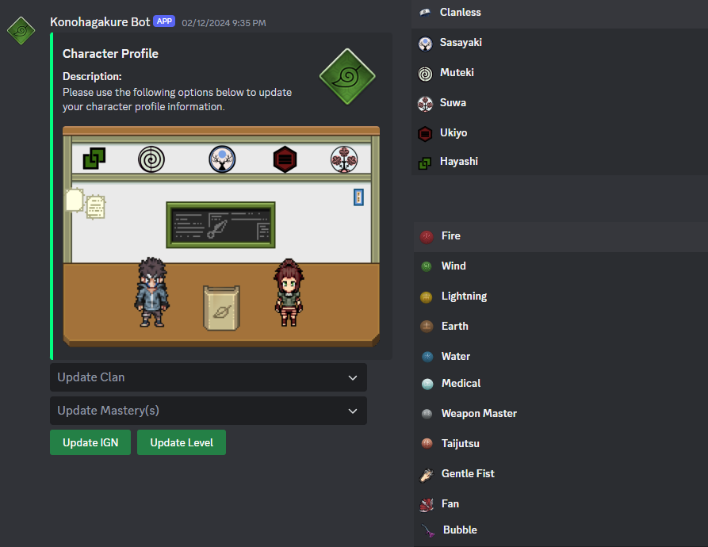

<!-- PROJECT LOGO -->
 

  
  <h1 align="center">Konohagakure</h3>

Konohagakure is a Discord Bot created using DSharpPlus library, an unofficial .NET wrapper for the Discord API. The motivation for developing Konohagakure was to maintain community leadership, player applications, organize raids, retrieve real-time statistics, etc. for an MMORPG. The game discussed is NinOnline, a Ninja MMORPG featuring a large explorable world where players choose to align themselves within 3 ninja factions.

The project incorporates software programming concepts and problem solving using the Object Oriented Programming paradigm.

### Built With

* Visual Studio 2022
* DBeaver
* DSharpPlus
* Kuylar.DsharpPlus.ButtonCommands
* XeroxDev.DsharpPlus.ModalCommands

## Features

- [x] Villager Application
  
This feature requires players to complete a Villager Application to gain access to the Discord server. Players will fill out their response to the questions in a Discord Modal component. The data submitted will be saved in a database to create unique user profiles. 

  

The application will then be sent to a private discord channel within the server, only accessible by the village Hokage and Council members. Within the channel, the Hokage or Councils will determine whether an individual will gain access. If the applicant is granted access, the roles (Villager) will be automatically given.

  

- [x] Character Profile Editor

The Character Profile Editor allows users with a user profile and villager role to edit their profiles. 

  

- [x] User Profile

Villagers with active profiles will be able to use the /profile command to preview their user profile.

  

- [x]  RP Request

This feature will allow villagers to request RP events ingame. The data submitted will then be used to create a request modal so that any ranked ninja will be able to proctor the event.

  

- [x] Hokage Dashhboard

The Hokage Dashboard is a feature only accessible to Hokage or Council ranked ninjas. The dashboard allows the user to delete a villager application from the database or to retrieve alt(s) from a user.

  

- [x] Raid HQ Dashhboard

The Raid HQ Dashboard is a feature only accessible to Raid Leaders. The dashboard allows Raid Leaders to increment all user's raid stats that are currently in the Village Raid Voice Channel. The dashboard contains a feature to retrieve a composition of masteries for all users inside the voice channel. The Voice Channel feature moves all the villagers in the Raid Lobby Channel to the Village Raid Channel.

  

<!-- LICENSE -->
## License

Distributed under the MIT License. See `LICENSE.txt` for more information.

<!-- CONTACT -->
## Contact

Your Name - Ricardo Montoya — montoya.ar94@gmail.com

Project Link: [https://github.com/MontoyaTM/Konohagakure](https://github.com/MontoyaTM/Konohagakure)
